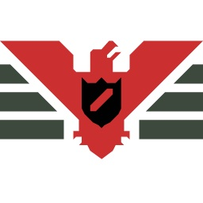

# Российская система возрастных рейтингов

Данный проект предназначен для определения возрастного рейтинга продукции.

## Зачем?

Федеральный закон от 29.12.2010 N 436-ФЗ (ред. от 14.10.2014) «О защите детей от информации, причиняющей вред их здоровью и развитию» (http://www.consultant.ru/document/cons_doc_LAW_169775/) содержит обширные перечни информационной продукции, запрещённой к распространению среди детей, а также информационной продукции, предназначенной для детей, достигших определённого возраста. 

Формулировки закона являются достаточно запутанными, с большим числом внутренних ссылок, повторений и т.п. Ввиду этого целесообразно было разработать программный продукт, который на основе предоставленной пользователем информации об информационном продукте позволяет определить возрастной рейтинг. 

## Начало работы

Проект выполнен в виде чат-бота для Telegram. Для того, чтобы начать его использовать нужно перейти по ссылке https://t.me/rars_bot или найти в Telegram бота @rars_bot (требуется активный аккаунт в Telegram).  


## Участие в разработке

Всем желающим предоставляется возможность участвовать в разработке проекта. Для этого нужно скронировать к себе репозиторий. 

```shell
git clone https://github.com/nlold/rars.git
```

Для тестирования вам понадобится Telegram-бот, а так же любой сервер с доменом и HTTPS протоколом. Если такой возможности нет, то рекомендуется использовать NGROK (https://ngrok.com).

## Конфигурация проекта

Для запуска локального запуска проекта нужно создать папку config в корне проекта и файл index.js в ней. Содержимое файла index.js:

```javascript
module.exports = {
  "token": "XXXXXXXXXX", // token Telegram бота
  "port": XXXX
}
```

Запуск проекта осуществляется командой:

```shell
npm start
```

## Лицензия

Исходный код данного проекта находится под лицензией MIT.